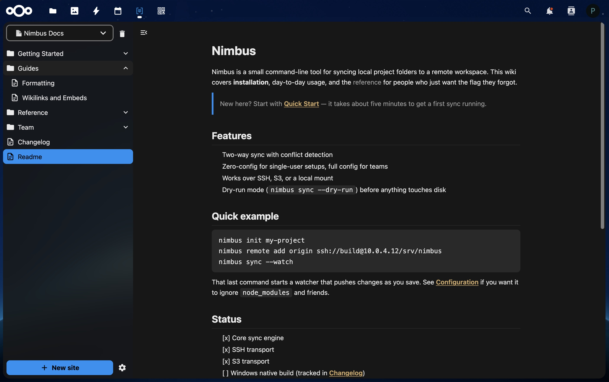
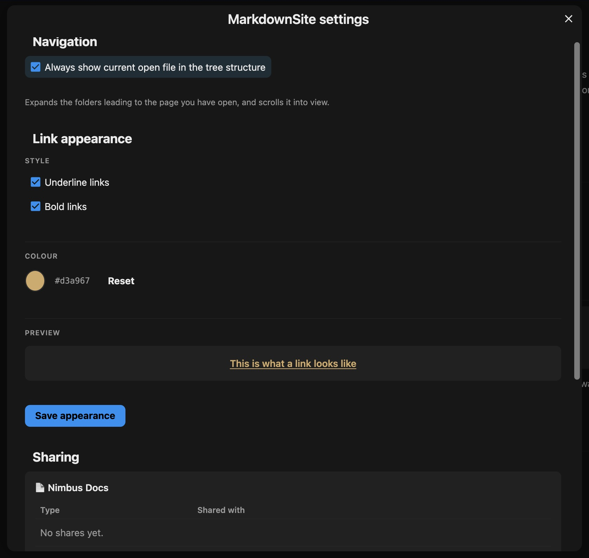

# MarkdownSite

Turn any folder of Markdown files into a browsable wiki site inside Nextcloud, editable in place.

Supports Obsidian-style wikilinks, embeds, and YAML frontmatter. Links resolve by page name, so a synced Obsidian vault or any Markdown folder just works — no renaming, no export step. Content stays editable in the Files app or via desktop sync; the reader reflects changes live.



## Features

- **Read a folder as a wiki** — pick any folder you own, MarkdownSite renders it as a navigable site with a page tree, no conversion step.
- **Obsidian-compatible links** — `[[wikilinks]]`, `[[Page|custom labels]]`, and embeds resolve by page name across the whole folder, not just relative paths. Broken links render struck-through instead of 404ing.
- **Share without a Files share** — grant a user or group access to a site without giving them Nextcloud Files access to the underlying folder, as a reader or an editor. Only the owner manages shares.
- **Edit in place** — press `E` or the pencil: live preview like Obsidian, autosave, `[[` completion, drag-and-drop images. Create, rename, move (links are updated) and delete pages and folders from the tree.
- **Reveal-active-file navigation** — the tree auto-expands and scrolls to whichever page is open, with a per-user toggle to turn it off.
- **Outline, breadcrumb, previous/next** — a sticky "On this page" outline, a breadcrumb, and previous/next links in tree order. Folder notes (`Folder/Folder.md`, `index.md`, `README.md`) open when their folder is clicked.
- **Code and diagrams** — highlighted code blocks with a copy button, and Mermaid diagrams, loaded only on pages that use them.
- **Search** — find pages by title, alias, heading or text in one site or all your sites, ignoring case and accents; matches are highlighted in the opened page.
- **Themeable link appearance** — underline, bold, and colour are configurable per user, with a live preview.



## Requirements

- Nextcloud 31–34
- PHP 8.1–8.5

## Installation

```bash
cd nextcloud/custom_apps
git clone https://github.com/qtld88/markdownsite.git
cd markdownsite
composer install --no-dev
occ app:enable markdownsite
```

## Development

```bash
npm ci
npm run build      # or: npm run watch
npm run lint

composer install
vendor/bin/phpunit
composer run lint
```

The PHP code is developed against the oldest supported Nextcloud API
(`nextcloud/ocp` `dev-stable31`), so a newer API cannot slip in unnoticed.

### Smoke test in Docker

```bash
scripts/smoke.sh 31    # or 34, or any nextcloud image tag
scripts/smoke.sh stop
```

The script builds the app, starts a throwaway Nextcloud with the app enabled,
uploads `tests/fixtures/smoke-site/` to the admin's files, creates a second
user `reader`, and prints the URL. Passwords are in `.smoke/credentials.txt`.

## License

AGPL-3.0-or-later
