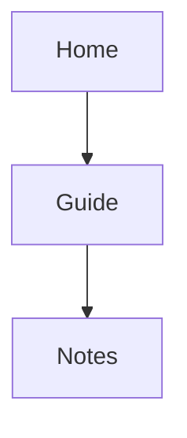

# Code Highlighting & Mermaid (C) Implementation Plan

> **For agentic workers:** REQUIRED SUB-SKILL: Use superpowers:subagent-driven-development (recommended) or superpowers:executing-plans to implement this plan task-by-task. Steps use checkbox (`- [ ]`) syntax for tracking.

**Goal:** Highlight fenced code blocks (with a language label and a copy button) and render Mermaid diagrams in reading view, loading highlight.js and Mermaid only on pages that need them.

**Architecture:** Fix lazy chunk loading by setting `__webpack_public_path__` at runtime from `generateFilePath()`, then drop the single-bundle constraint. Two DOM post-processors run after each page render, like `decorateCallouts()`: `decorateCode()` (highlight.js core + one chunk per language) and `renderDiagrams()` (Mermaid ESM, code-split per diagram type). Every dynamic import goes through `loadChunk()`, which turns a failed chunk into a console warning and plain content.

**Tech Stack:** webpack 5 (`@nextcloud/webpack-vue-config` 6), highlight.js 11.12, Mermaid 11.17, Vitest 3.2 + jsdom 26, Vue 3.5.

**Spec:** `docs/superpowers/specs/2026-10-02-markdownsite-code-mermaid-design.md`
**Depends on:** plans A and B (Vitest, `tests/js/`, `scripts/smoke.sh`, fixture site, `WikiView` layout).

---

## Assumptions and spec corrections

1. **Mermaid 11, not 12.** Mermaid 12.1 declares `engines.node >= 22.12`; this repo declares Node ≥ 20. Mermaid 11.17.2 has the same API used here (`initialize`, `render`) and no engine constraint.
2. **Mermaid is imported as ESM (`import('mermaid')`), so it is split into many chunks.** Mermaid loads each diagram type lazily; with chunk loading fixed, webpack emits one file per diagram type and dependency (about 70 files plus source maps under `js/`). A flowchart page fetched 5 chunks in testing. File names carry no hash (the hash is in `?v=`), so a rebuild only changes files whose content changed. The single-file UMD build (`mermaid.min.js`, 3.5 MB) remains the spec's fallback if chunks fail on the hosted instance.
3. **Highlighted languages are an explicit list** of 33 common ones (bash, python, yaml, json, markdown, javascript, …) plus aliases (`sh`, `py`, `yml`, `js`, `md`, `html`, …). A template `import()` over `highlight.js/lib/languages/*` would emit ~190 chunks. Any other language keeps its label and stays plain, as the spec allows for unknown languages.
4. **`output.chunkFilename` already defaults to `markdownsite-[name].js?v=[contenthash]`** in `@nextcloud/webpack-vue-config` 6.3. The plan still sets it explicitly so the cache-busting intent is visible in `webpack.config.js`.
5. **Copy logic is shared through a new `src/services/clipboard.js`** (`icon`, `copy`, `flashDone`), extracted from `calloutCopy.js` without behaviour change, so the code copy button shows the same "done" state as the callout one.
6. **Theme detection.** Nextcloud 31 sets `<body data-themes="…">`: `default` (follow the system), `light…` or `dark…` (verified on a `nextcloud:31` container: `default` out of the box, `dark` after choosing the dark theme). `isDarkTheme()` and the CSS palette both treat anything that is neither `light` nor `dark` as "follow `prefers-color-scheme`". The palette lives in an unscoped `<style>` block of `WikiView.vue` because it depends on `<body>`.
7. **The language label shows the fence text as written** (`bash`, `dataview`), lower-cased.
8. **CSP: no change needed.** Verified on `nextcloud:31` in headless Chromium: chunks load from `custom_apps/markdownsite/js/`, a flowchart renders, no CSP violation is reported.
9. **Tests use jsdom per file** (`// @vitest-environment jsdom`); the B tests keep running in Node. `loadChunk` is mocked with a pass-through spy so "no code block → nothing loaded" is checked without depending on test order. highlight.js itself is real in the tests; Mermaid is mocked (the spec asks for it).

Verified while writing this plan on `nextcloud:31` with the plan A smoke script and headless Chromium: no extra chunk on a page without code; `hljs-core`, `hljs-bash`, `hljs-python`, `hljs-yaml` on the code page; labels `bash`, `python`, `yaml`, `dataview`; copy puts the raw text on the clipboard and shows the check mark; one diagram rendered and one "Invalid diagram" box; "New site → Choose folder…" opens the file picker; light and dark themes both readable.

## File map

| File | Change |
|---|---|
| `src/publicPath.js`, `src/main.js` | Runtime public path, imported first |
| `webpack.config.js` | Single-bundle constraint removed, `chunkFilename` |
| `src/services/chunks.js` + `tests/js/chunks.test.js` | New: `loadChunk()` |
| `src/services/theme.js` + `tests/js/theme.test.js` | New: `isDarkTheme()` |
| `src/services/clipboard.js`, `src/services/calloutCopy.js` | Copy helpers extracted |
| `src/services/codeHighlight.js` + `tests/js/codeHighlight.test.js` | New: `decorateCode()` |
| `src/services/mermaid.js` + `tests/js/mermaid.test.js` | New: `renderDiagrams()` |
| `package.json`, `package-lock.json` | `highlight.js`, `mermaid`, `jsdom` |
| `src/views/WikiView.vue` | Calls both decorators; code, token and diagram styles |
| `tests/fixtures/smoke-site/Guides/Code.md`, `Diagrams.md` | New fixture pages |
| `.claude/skills/nextcloud-app-store-publish/SKILL.md` | Tarball must hold every `js/markdownsite-*.js` |
| `appinfo/info.xml`, `CHANGELOG.md`, `README.md`, `js/*` | 1.4.0 |

---

### Task 1: Load lazy chunks from the right place

**Files:**
- Create: `src/publicPath.js`
- Modify: `src/main.js`, `webpack.config.js`

- [ ] **Step 1: Show the current single bundle**

Run: `npm run build >/dev/null && ls js | grep -c FilePicker`
Expected: `0` (the file picker is inlined in `markdownsite-main.js`).

- [ ] **Step 2: Set the public path at runtime**

Create `src/publicPath.js`:

```js
import { generateFilePath } from '@nextcloud/router'

// Lazy chunks must load from where Nextcloud actually serves this app's js/
// (often custom_apps/), not from the build-time default /apps/markdownsite/js/.
// eslint-disable-next-line no-undef, camelcase
__webpack_public_path__ = generateFilePath('markdownsite', '', 'js/')
```

In `src/main.js`, add this as the very first line (before `import { createApp } from 'vue'`):

```js
import './publicPath.js'
```

- [ ] **Step 3: Remove the single-chunk constraint**

Replace `webpack.config.js` with:

```js
const path = require('path');
const webpackConfig = require('@nextcloud/webpack-vue-config');

webpackConfig.entry = {
	main: path.join(__dirname, 'src', 'main.js'),
};

// Lazy chunks (file picker, highlight.js, Mermaid) load from the path set at
// runtime in src/publicPath.js. The content hash in the query string makes a
// new release fetch new chunks: Nextcloud's own ?v= cache-buster only covers
// the entry script.
webpackConfig.output.chunkFilename = 'markdownsite-[name].js?v=[contenthash]';

module.exports = webpackConfig;
```

- [ ] **Step 4: Build and check the chunks**

Run: `npm run build 2>&1 | grep compiled && ls js | grep -c FilePicker`
Expected: `webpack … compiled with 2 warnings` and `3` (the picker chunk, its `.map` and its `.LICENSE.txt`).

Run: `npm run lint && npm test`
Expected: lint exit code 0, `Tests  17 passed (17)`.

- [ ] **Step 5: Commit**

```bash
git add src/publicPath.js src/main.js webpack.config.js
git commit -m "fix: load lazy chunks from the app's real web path"
```

(`js/` is rebuilt and committed in the release task.)

---

### Task 2: `loadChunk()` — never break on a failed chunk

**Files:**
- Create: `tests/js/chunks.test.js`, `src/services/chunks.js`

- [ ] **Step 1: Write the failing test**

`tests/js/chunks.test.js`:

```js
import { describe, expect, it, vi } from 'vitest'
import { loadChunk } from '../../src/services/chunks.js'

describe('loadChunk', () => {
	it('returns the loaded module', async () => {
		expect(await loadChunk(async () => ({ default: 42 }), 'x')).toEqual({ default: 42 })
	})

	it('returns null and warns when the chunk fails', async () => {
		const warn = vi.spyOn(console, 'warn').mockImplementation(() => {})
		const error = Object.assign(new Error('Loading chunk 7 failed.'), { name: 'ChunkLoadError' })
		expect(await loadChunk(async () => { throw error }, 'Mermaid')).toBeNull()
		expect(warn).toHaveBeenCalledWith(expect.stringContaining('Mermaid'), error)
		warn.mockRestore()
	})
})
```

- [ ] **Step 2: Run it to see it fail**

Run: `npm test`
Expected: FAIL — `Cannot find module '../../src/services/chunks.js'`.

- [ ] **Step 3: Write the helper**

`src/services/chunks.js`:

```js
/**
 * Runs a dynamic import. If the chunk cannot be loaded (ChunkLoadError,
 * network error) it logs a warning and returns null, so the page keeps its
 * plain rendering instead of breaking.
 *
 * @param {Function} load e.g. () => import('highlight.js/lib/core')
 * @param {string} what name used in the warning
 * @return {Promise<object|null>} the module, or null
 */
export async function loadChunk(load, what) {
	try {
		return await load()
	} catch (error) {
		console.warn(`[markdownsite] could not load ${what}; showing plain content`, error)
		return null
	}
}
```

- [ ] **Step 4: Run the tests**

Run: `npm test`
Expected: `Tests  19 passed (19)`.

- [ ] **Step 5: Commit**

```bash
git add tests/js/chunks.test.js src/services/chunks.js
git commit -m "feat: degrade gracefully when a lazy chunk fails to load"
```

---

### Task 3: `isDarkTheme()`

**Files:**
- Create: `tests/js/theme.test.js`, `src/services/theme.js`

- [ ] **Step 1: Write the failing test**

`tests/js/theme.test.js`:

```js
import { describe, expect, it } from 'vitest'
import { isDarkTheme } from '../../src/services/theme.js'

const body = (themes) => ({ dataset: themes === undefined ? {} : { themes } })
const media = (dark) => () => ({ matches: dark })

describe('isDarkTheme', () => {
	it('follows an explicit dark or light theme', () => {
		expect(isDarkTheme(body('dark'), media(false))).toBe(true)
		expect(isDarkTheme(body('dark-highcontrast'), media(false))).toBe(true)
		expect(isDarkTheme(body('light'), media(true))).toBe(false)
	})

	it('follows the system preference for the default theme', () => {
		expect(isDarkTheme(body('default'), media(true))).toBe(true)
		expect(isDarkTheme(body('default'), media(false))).toBe(false)
		expect(isDarkTheme(body(undefined), media(true))).toBe(true)
	})
})
```

- [ ] **Step 2: Run it to see it fail**

Run: `npm test`
Expected: FAIL — `Cannot find module '../../src/services/theme.js'`.

- [ ] **Step 3: Write the helper**

`src/services/theme.js`:

```js
/**
 * True when Nextcloud shows its dark theme. The body's data-themes lists the
 * enabled themes ("dark", "dark-highcontrast", "light", …); "default" means
 * "follow the system", which the prefers-color-scheme query decides.
 */
export function isDarkTheme(body = document.body, matchMedia = (query) => window.matchMedia?.(query)) {
	const themes = body?.dataset?.themes || ''
	if (themes.includes('dark')) {
		return true
	}
	if (themes.includes('light')) {
		return false
	}
	return !!matchMedia?.('(prefers-color-scheme: dark)')?.matches
}
```

- [ ] **Step 4: Run the tests**

Run: `npm test`
Expected: `Tests  21 passed (21)`.

- [ ] **Step 5: Commit**

```bash
git add tests/js/theme.test.js src/services/theme.js
git commit -m "feat: detect Nextcloud's dark theme"
```

---

### Task 4: Share the copy helpers

**Files:**
- Create: `src/services/clipboard.js`
- Replace: `src/services/calloutCopy.js`

- [ ] **Step 1: Create `src/services/clipboard.js`**

```js
import { mdiCheck, mdiContentCopy } from '@mdi/js'

const SVG_NS = 'http://www.w3.org/2000/svg'

/** An 18 px inline SVG icon from an @mdi/js path. */
export function icon(path) {
	const svg = document.createElementNS(SVG_NS, 'svg')
	svg.setAttribute('viewBox', '0 0 24 24')
	svg.setAttribute('width', '18')
	svg.setAttribute('height', '18')
	svg.setAttribute('aria-hidden', 'true')
	const p = document.createElementNS(SVG_NS, 'path')
	p.setAttribute('d', path)
	p.setAttribute('fill', 'currentColor')
	svg.appendChild(p)
	return svg
}

function legacyCopy(text, html) {
	const holder = document.createElement(html ? 'div' : 'textarea')
	holder.style.cssText = 'position:fixed;left:-9999px;top:0;white-space:pre-wrap'
	if (html) {
		holder.contentEditable = 'true'
		holder.innerHTML = html
	} else {
		holder.value = text
	}
	document.body.appendChild(holder)
	try {
		if (html) {
			const range = document.createRange()
			range.selectNodeContents(holder)
			const sel = window.getSelection()
			sel.removeAllRanges()
			sel.addRange(range)
		} else {
			holder.select()
		}
		return document.execCommand('copy')
	} finally {
		window.getSelection()?.removeAllRanges()
		holder.remove()
	}
}

/** Copies `text` (and `html`, as rich text, when given). Resolves to true on success. */
export async function copy(text, html = null) {
	try {
		if (html && window.ClipboardItem && navigator.clipboard?.write) {
			await navigator.clipboard.write([new ClipboardItem({
				'text/html': new Blob([html], { type: 'text/html' }),
				'text/plain': new Blob([text], { type: 'text/plain' }),
			})])
			return true
		}
		if (!html && navigator.clipboard?.writeText) {
			await navigator.clipboard.writeText(text)
			return true
		}
	} catch (e) {
		// fall through to the legacy path
	}
	return legacyCopy(text, html)
}

/** Shows a check mark on a copy button for 1.5 s ("done" state). */
export function flashDone(button) {
	button.replaceChildren(icon(mdiCheck))
	button.classList.add('is-done')
	setTimeout(() => {
		button.replaceChildren(icon(mdiContentCopy))
		button.classList.remove('is-done')
	}, 1500)
}
```

- [ ] **Step 2: Replace `src/services/calloutCopy.js`**

Same behaviour; the icon, copy and "done" helpers now come from `clipboard.js`:

```js
import { translate as t } from '@nextcloud/l10n'
import { mdiContentCopy } from '@mdi/js'
import { copy, flashDone, icon } from './clipboard.js'

/** HTML of the callout body, made self-contained for pasting into an email. */
function bodyHtml(content) {
	const clone = content.cloneNode(true)
	clone.querySelectorAll('a[href]').forEach((a) => { a.setAttribute('href', a.href) })
	clone.querySelectorAll('img[src]').forEach((img) => { img.setAttribute('src', img.src) })
	clone.querySelectorAll('table').forEach((el) => el.setAttribute('style', 'border-collapse:collapse'))
	clone.querySelectorAll('th, td').forEach((el) => el.setAttribute('style', 'border:1px solid #ccc;padding:4px 8px;text-align:left'))
	clone.querySelectorAll('th').forEach((el) => el.setAttribute('style', 'border:1px solid #ccc;padding:4px 8px;text-align:left;background:#f0f0f0'))
	clone.querySelectorAll('mark').forEach((el) => el.setAttribute('style', 'background:#ffe97a'))
	clone.querySelectorAll('input[type=checkbox]').forEach((el) => el.replaceWith(el.checked ? '☑ ' : '☐ '))
	return clone.innerHTML
}

function closeMenus(except = null) {
	document.querySelectorAll('.mds-callout-menu').forEach((m) => {
		if (m !== except) {
			m.hidden = true
			m.parentElement?.querySelector('.mds-callout-copy')?.setAttribute('aria-expanded', 'false')
		}
	})
}

let globalListenersBound = false
function bindGlobalListeners() {
	if (globalListenersBound) { return }
	globalListenersBound = true
	document.addEventListener('click', (ev) => {
		if (!ev.target.closest?.('.mds-callout-actions')) { closeMenus() }
	})
	document.addEventListener('keydown', (ev) => {
		if (ev.key === 'Escape') { closeMenus() }
	})
}

function decorate(callout) {
	if (callout.querySelector(':scope > .mds-callout-title .mds-callout-actions')) { return }
	const title = callout.querySelector(':scope > .mds-callout-title')
	const content = callout.querySelector(':scope > .mds-callout-content')
	if (!title || !content) { return }

	const actions = document.createElement('span')
	actions.className = 'mds-callout-actions'

	const button = document.createElement('button')
	button.type = 'button'
	button.className = 'mds-callout-copy'
	button.title = t('markdownsite', 'Copy')
	button.setAttribute('aria-label', t('markdownsite', 'Copy'))
	button.setAttribute('aria-haspopup', 'true')
	button.setAttribute('aria-expanded', 'false')
	button.appendChild(icon(mdiContentCopy))

	const menu = document.createElement('div')
	menu.className = 'mds-callout-menu'
	menu.hidden = true

	const addItem = (label, handler) => {
		const item = document.createElement('button')
		item.type = 'button'
		item.textContent = label
		item.addEventListener('click', async (ev) => {
			ev.preventDefault()
			ev.stopPropagation()
			menu.hidden = true
			button.setAttribute('aria-expanded', 'false')
			if (await handler()) { flashDone(button) }
		})
		menu.appendChild(item)
	}

	const markdown = callout.getAttribute('data-markdown')
	if (markdown) {
		addItem(t('markdownsite', 'Copy as Markdown'), () => copy(markdown))
	}
	addItem(t('markdownsite', 'Copy as HTML (e.g. for an email)'), () => copy(content.innerText.trim(), bodyHtml(content)))

	button.addEventListener('click', (ev) => {
		// The button sits inside <summary> for foldable callouts: don't toggle it.
		ev.preventDefault()
		ev.stopPropagation()
		const willOpen = menu.hidden
		closeMenus(menu)
		menu.hidden = !willOpen
		button.setAttribute('aria-expanded', String(willOpen))
	})

	actions.append(button, menu)
	title.appendChild(actions)
}

/** Adds a "copy" button with a Markdown / HTML choice to every callout under `root`. */
export function decorateCallouts(root) {
	if (!root) { return }
	bindGlobalListeners()
	root.querySelectorAll('.mds-callout').forEach(decorate)
}
```

- [ ] **Step 3: Lint, test, build**

Run: `npm run lint && npm test && npm run build 2>&1 | grep compiled`
Expected: lint exit code 0, `Tests  21 passed (21)`, `compiled with 2 warnings`.

- [ ] **Step 4: Commit**

```bash
git add src/services/clipboard.js src/services/calloutCopy.js
git commit -m "refactor: share clipboard helpers between copy buttons"
```

---

### Task 5: `decorateCode()` — labels, copy buttons, highlight.js

**Files:**
- Modify: `package.json`, `package-lock.json`
- Create: `tests/js/codeHighlight.test.js`, `src/services/codeHighlight.js`

- [ ] **Step 1: Install highlight.js and jsdom**

```bash
npm install highlight.js@^11.12.0
npm install --save-dev jsdom@^26.1.0
```

Run: `grep -n '"highlight.js"\|"jsdom"' package.json`
Expected: `"highlight.js": "^11.12.0"` under `dependencies`, `"jsdom": "^26.1.0"` under `devDependencies`.

- [ ] **Step 2: Write the failing test**

`tests/js/codeHighlight.test.js`:

```js
// @vitest-environment jsdom
import { beforeEach, describe, expect, it, vi } from 'vitest'
import { decorateCode, resolveLanguage } from '../../src/services/codeHighlight.js'
import { loadChunk } from '../../src/services/chunks.js'

vi.mock('../../src/services/chunks.js', () => ({
	loadChunk: vi.fn(async (load) => load()),
}))

function article(html) {
	const el = document.createElement('article')
	el.innerHTML = html
	document.body.replaceChildren(el)
	return el
}

describe('decorateCode', () => {
	beforeEach(() => {
		loadChunk.mockClear()
	})

	it('loads nothing when the page has no code block', async () => {
		const el = article('<p>Just text with <code>inline code</code>.</p>')
		await decorateCode(el)
		expect(loadChunk).not.toHaveBeenCalled()
		expect(el.querySelector('.mds-code')).toBeNull()
	})

	it('highlights a known language and shows its label', async () => {
		const el = article('<pre><code class="language-bash">echo "hi" # greet\n</code></pre>')
		await decorateCode(el)
		const box = el.querySelector('.mds-code')
		expect(box).not.toBeNull()
		expect(box.querySelector('.mds-code-lang').textContent).toBe('bash')
		expect(box.querySelector('code').classList.contains('hljs')).toBe(true)
		expect(box.querySelector('code .hljs-string')).not.toBeNull()
		expect(box.querySelector('code').textContent).toBe('echo "hi" # greet\n')
	})

	it('resolves aliases', async () => {
		expect(resolveLanguage('sh')).toBe('bash')
		expect(resolveLanguage('yml')).toBe('yaml')
		expect(resolveLanguage('py')).toBe('python')
		expect(resolveLanguage('constructor')).toBeNull()
	})

	it('leaves an unknown language plain but labelled, without loading highlight.js', async () => {
		const el = article('<pre><code class="language-dataview">TABLE file.name</code></pre>')
		await decorateCode(el)
		expect(el.querySelector('.mds-code-lang').textContent).toBe('dataview')
		expect(el.querySelector('code').innerHTML).toBe('TABLE file.name')
		expect(loadChunk).not.toHaveBeenCalled()
	})

	it('skips Mermaid blocks', async () => {
		const el = article('<pre><code class="language-mermaid">graph TD; A--&gt;B</code></pre>')
		await decorateCode(el)
		expect(el.querySelector('.mds-code')).toBeNull()
		expect(loadChunk).not.toHaveBeenCalled()
	})

	it('copies the raw code text', async () => {
		const writeText = vi.fn().mockResolvedValue()
		Object.defineProperty(navigator, 'clipboard', { value: { writeText }, configurable: true })
		const el = article('<pre><code class="language-python">print("a &lt; b")\n</code></pre>')
		await decorateCode(el)
		el.querySelector('.mds-code-copy').click()
		await vi.waitFor(() => expect(writeText).toHaveBeenCalledWith('print("a < b")\n'))
		await vi.waitFor(() => expect(el.querySelector('.mds-code-copy').classList.contains('is-done')).toBe(true))
	})

	it('keeps the label and plain text when highlight.js fails to load', async () => {
		loadChunk.mockResolvedValueOnce(null)
		const el = article('<pre><code class="language-yaml">a: 1</code></pre>')
		await decorateCode(el)
		expect(el.querySelector('.mds-code-lang').textContent).toBe('yaml')
		expect(el.querySelector('code').innerHTML).toBe('a: 1')
	})
})
```

- [ ] **Step 3: Run it to see it fail**

Run: `npm test`
Expected: FAIL — `Failed to resolve import "../../src/services/codeHighlight.js" from "tests/js/codeHighlight.test.js"`.

- [ ] **Step 4: Write the decorator**

`src/services/codeHighlight.js`:

```js
import { translate as t } from '@nextcloud/l10n'
import { mdiContentCopy } from '@mdi/js'
import { loadChunk } from './chunks.js'
import { copy, flashDone, icon } from './clipboard.js'

// One lazy chunk per language. Only these are highlighted; any other
// language keeps its label and stays plain text.
const LANGUAGES = {
	apache: () => import(/* webpackChunkName: "hljs-apache" */ 'highlight.js/lib/languages/apache'),
	bash: () => import(/* webpackChunkName: "hljs-bash" */ 'highlight.js/lib/languages/bash'),
	c: () => import(/* webpackChunkName: "hljs-c" */ 'highlight.js/lib/languages/c'),
	cpp: () => import(/* webpackChunkName: "hljs-cpp" */ 'highlight.js/lib/languages/cpp'),
	csharp: () => import(/* webpackChunkName: "hljs-csharp" */ 'highlight.js/lib/languages/csharp'),
	css: () => import(/* webpackChunkName: "hljs-css" */ 'highlight.js/lib/languages/css'),
	diff: () => import(/* webpackChunkName: "hljs-diff" */ 'highlight.js/lib/languages/diff'),
	dockerfile: () => import(/* webpackChunkName: "hljs-dockerfile" */ 'highlight.js/lib/languages/dockerfile'),
	go: () => import(/* webpackChunkName: "hljs-go" */ 'highlight.js/lib/languages/go'),
	ini: () => import(/* webpackChunkName: "hljs-ini" */ 'highlight.js/lib/languages/ini'),
	java: () => import(/* webpackChunkName: "hljs-java" */ 'highlight.js/lib/languages/java'),
	javascript: () => import(/* webpackChunkName: "hljs-javascript" */ 'highlight.js/lib/languages/javascript'),
	json: () => import(/* webpackChunkName: "hljs-json" */ 'highlight.js/lib/languages/json'),
	kotlin: () => import(/* webpackChunkName: "hljs-kotlin" */ 'highlight.js/lib/languages/kotlin'),
	latex: () => import(/* webpackChunkName: "hljs-latex" */ 'highlight.js/lib/languages/latex'),
	lua: () => import(/* webpackChunkName: "hljs-lua" */ 'highlight.js/lib/languages/lua'),
	makefile: () => import(/* webpackChunkName: "hljs-makefile" */ 'highlight.js/lib/languages/makefile'),
	markdown: () => import(/* webpackChunkName: "hljs-markdown" */ 'highlight.js/lib/languages/markdown'),
	nginx: () => import(/* webpackChunkName: "hljs-nginx" */ 'highlight.js/lib/languages/nginx'),
	perl: () => import(/* webpackChunkName: "hljs-perl" */ 'highlight.js/lib/languages/perl'),
	php: () => import(/* webpackChunkName: "hljs-php" */ 'highlight.js/lib/languages/php'),
	powershell: () => import(/* webpackChunkName: "hljs-powershell" */ 'highlight.js/lib/languages/powershell'),
	python: () => import(/* webpackChunkName: "hljs-python" */ 'highlight.js/lib/languages/python'),
	r: () => import(/* webpackChunkName: "hljs-r" */ 'highlight.js/lib/languages/r'),
	ruby: () => import(/* webpackChunkName: "hljs-ruby" */ 'highlight.js/lib/languages/ruby'),
	rust: () => import(/* webpackChunkName: "hljs-rust" */ 'highlight.js/lib/languages/rust'),
	scss: () => import(/* webpackChunkName: "hljs-scss" */ 'highlight.js/lib/languages/scss'),
	shell: () => import(/* webpackChunkName: "hljs-shell" */ 'highlight.js/lib/languages/shell'),
	sql: () => import(/* webpackChunkName: "hljs-sql" */ 'highlight.js/lib/languages/sql'),
	swift: () => import(/* webpackChunkName: "hljs-swift" */ 'highlight.js/lib/languages/swift'),
	typescript: () => import(/* webpackChunkName: "hljs-typescript" */ 'highlight.js/lib/languages/typescript'),
	xml: () => import(/* webpackChunkName: "hljs-xml" */ 'highlight.js/lib/languages/xml'),
	yaml: () => import(/* webpackChunkName: "hljs-yaml" */ 'highlight.js/lib/languages/yaml'),
}

const ALIASES = {
	sh: 'bash', zsh: 'bash', console: 'shell', 'c++': 'cpp', cs: 'csharp', 'c#': 'csharp',
	docker: 'dockerfile', golang: 'go', toml: 'ini', js: 'javascript', jsx: 'javascript',
	mjs: 'javascript', cjs: 'javascript', jsonc: 'json', kt: 'kotlin', tex: 'latex',
	make: 'makefile', md: 'markdown', pl: 'perl', ps1: 'powershell', ps: 'powershell',
	py: 'python', rb: 'ruby', rs: 'rust', ts: 'typescript', tsx: 'typescript',
	html: 'xml', xhtml: 'xml', svg: 'xml', yml: 'yaml',
}

/** The language written after the opening fence (`language-xyz` class), lower-cased. */
export function languageOf(code) {
	const match = /(?:^|\s)language-(\S+)/.exec(code.className)
	return match ? match[1].toLowerCase() : ''
}

/** highlight.js module name for a fence language, or null when not supported. */
export function resolveLanguage(lang) {
	const name = ALIASES[lang] || lang
	return Object.prototype.hasOwnProperty.call(LANGUAGES, name) ? name : null
}

/** Wraps a `<pre>` in `.mds-code` with a header holding the language label and a copy button. */
function wrap(code) {
	const pre = code.parentElement
	if (pre.parentElement?.classList.contains('mds-code')) {
		return
	}
	const box = document.createElement('div')
	box.className = 'mds-code'

	const header = document.createElement('div')
	header.className = 'mds-code-header'
	const label = document.createElement('span')
	label.className = 'mds-code-lang'
	label.textContent = languageOf(code)

	const button = document.createElement('button')
	button.type = 'button'
	button.className = 'mds-code-copy'
	button.title = t('markdownsite', 'Copy')
	button.setAttribute('aria-label', t('markdownsite', 'Copy'))
	button.appendChild(icon(mdiContentCopy))
	button.addEventListener('click', async () => {
		if (await copy(code.textContent)) {
			flashDone(button)
		}
	})

	header.append(label, button)
	pre.replaceWith(box)
	box.append(header, pre)
}

/**
 * Adds a language label and a copy button to every fenced code block under
 * `root` (Mermaid blocks excepted), then highlights the supported languages.
 * highlight.js is only downloaded when the page has such a block.
 */
export async function decorateCode(root) {
	if (!root) {
		return
	}
	const blocks = [...root.querySelectorAll('pre > code[class*="language-"]')]
		.filter(code => !code.classList.contains('language-mermaid'))
	if (!blocks.length) {
		return
	}
	blocks.forEach(wrap)

	const wanted = new Set(blocks.map(code => resolveLanguage(languageOf(code))).filter(Boolean))
	if (!wanted.size) {
		return
	}
	const core = await loadChunk(() => import(/* webpackChunkName: "hljs-core" */ 'highlight.js/lib/core'), 'highlight.js')
	if (!core) {
		return
	}
	const hljs = core.default
	await Promise.all([...wanted].map(async (name) => {
		if (hljs.getLanguage(name)) {
			return
		}
		const language = await loadChunk(LANGUAGES[name], `highlight.js (${name})`)
		if (language) {
			hljs.registerLanguage(name, language.default)
		}
	}))

	for (const code of blocks) {
		const name = resolveLanguage(languageOf(code))
		// The reader may have moved on while the chunks were loading.
		if (!name || !code.isConnected || !hljs.getLanguage(name)) {
			continue
		}
		code.innerHTML = hljs.highlight(code.textContent, { language: name, ignoreIllegals: true }).value
		code.classList.add('hljs')
	}
}
```

- [ ] **Step 5: Run the tests**

Run: `npm test && npm run lint`
Expected: `Tests  28 passed (28)`, lint exit code 0.

- [ ] **Step 6: Commit**

```bash
git add package.json package-lock.json tests/js/codeHighlight.test.js src/services/codeHighlight.js
git commit -m "feat: highlight code blocks with a language label and copy button"
```

---

### Task 6: `renderDiagrams()` — Mermaid

**Files:**
- Modify: `package.json`, `package-lock.json`
- Create: `tests/js/mermaid.test.js`, `src/services/mermaid.js`

- [ ] **Step 1: Install Mermaid**

```bash
npm install mermaid@^11.17.2
```

Run: `grep -n '"mermaid"' package.json`
Expected: `"mermaid": "^11.17.2"` under `dependencies`.

- [ ] **Step 2: Write the failing test**

`tests/js/mermaid.test.js`:

```js
// @vitest-environment jsdom
import { beforeEach, describe, expect, it, vi } from 'vitest'
import mermaid from 'mermaid'
import { renderDiagrams, resetMermaidForTests } from '../../src/services/mermaid.js'
import { loadChunk } from '../../src/services/chunks.js'

vi.mock('mermaid', () => ({
	default: { initialize: vi.fn(), render: vi.fn() },
}))
vi.mock('../../src/services/chunks.js', () => ({
	loadChunk: vi.fn(async (load) => load()),
}))

function article(html) {
	const el = document.createElement('article')
	el.innerHTML = html
	document.body.replaceChildren(el)
	return el
}

describe('renderDiagrams', () => {
	beforeEach(() => {
		loadChunk.mockClear()
		mermaid.initialize.mockClear()
		mermaid.render.mockReset()
		resetMermaidForTests()
	})

	it('loads nothing when the page has no diagram', async () => {
		const el = article('<pre><code class="language-bash">ls</code></pre>')
		await renderDiagrams(el)
		expect(loadChunk).not.toHaveBeenCalled()
	})

	it('replaces a diagram with its SVG, using strict security', async () => {
		mermaid.render.mockResolvedValue({ svg: '<svg data-test="diagram"></svg>' })
		const el = article('<pre><code class="language-mermaid">graph TD; A--&gt;B</code></pre>')
		await renderDiagrams(el)
		expect(mermaid.initialize).toHaveBeenCalledWith(expect.objectContaining({ startOnLoad: false, securityLevel: 'strict' }))
		expect(mermaid.render).toHaveBeenCalledWith(expect.any(String), 'graph TD; A-->B')
		expect(el.querySelector('.mds-mermaid svg[data-test="diagram"]')).not.toBeNull()
		expect(el.querySelector('pre')).toBeNull()
	})

	it('shows an error box with the source when the diagram is invalid', async () => {
		mermaid.render.mockRejectedValue(new Error('Parse error on line 1'))
		const el = article('<pre><code class="language-mermaid">graph ???</code></pre>')
		await renderDiagrams(el)
		const box = el.querySelector('.mds-mermaid-error')
		expect(box).not.toBeNull()
		expect(box.textContent).toContain('Invalid diagram')
		expect(box.querySelector('pre code').textContent).toBe('graph ???')
	})

	it('uses the dark theme when Nextcloud is dark', async () => {
		document.body.dataset.themes = 'dark'
		mermaid.render.mockResolvedValue({ svg: '<svg></svg>' })
		const el = article('<pre><code class="language-mermaid">graph TD; A</code></pre>')
		document.body.dataset.themes = 'dark'
		await renderDiagrams(el)
		expect(mermaid.initialize).toHaveBeenCalledWith(expect.objectContaining({ theme: 'dark' }))
		delete document.body.dataset.themes
	})
})
```

- [ ] **Step 3: Run it to see it fail**

Run: `npm test`
Expected: FAIL — `Failed to resolve import "../../src/services/mermaid.js" from "tests/js/mermaid.test.js"`.

- [ ] **Step 4: Write the renderer**

`src/services/mermaid.js`:

```js
import { translate as t } from '@nextcloud/l10n'
import { loadChunk } from './chunks.js'
import { isDarkTheme } from './theme.js'

let initialisedTheme = null
let counter = 0

/**
 * Replaces every ```mermaid block under `root` with its rendered diagram.
 * Mermaid is only downloaded when the page has a diagram. A diagram that
 * does not parse becomes an "Invalid diagram" box followed by its source.
 */
export async function renderDiagrams(root) {
	if (!root) {
		return
	}
	const blocks = [...root.querySelectorAll('pre > code.language-mermaid')]
	if (!blocks.length) {
		return
	}
	const mod = await loadChunk(() => import(/* webpackChunkName: "mermaid" */ 'mermaid'), 'Mermaid')
	if (!mod) {
		return
	}
	const mermaid = mod.default
	// The theme is read once per render: a theme switch applies to the next page.
	const theme = isDarkTheme() ? 'dark' : 'default'
	if (initialisedTheme !== theme) {
		mermaid.initialize({ startOnLoad: false, securityLevel: 'strict', theme })
		initialisedTheme = theme
	}

	for (const code of blocks) {
		const pre = code.parentElement
		if (!pre?.isConnected) {
			continue
		}
		const id = `mds-mermaid-${++counter}`
		const box = document.createElement('div')
		try {
			const { svg } = await mermaid.render(id, code.textContent)
			box.className = 'mds-mermaid'
			box.innerHTML = svg
		} catch (error) {
			// Mermaid may leave its scratch element behind on failure.
			document.getElementById(`d${id}`)?.remove()
			box.className = 'mds-mermaid-error'
			const title = document.createElement('p')
			title.className = 'mds-mermaid-error-title'
			title.textContent = t('markdownsite', 'Invalid diagram')
			const source = document.createElement('pre')
			const sourceCode = document.createElement('code')
			sourceCode.textContent = code.textContent
			source.appendChild(sourceCode)
			box.append(title, source)
		}
		pre.replaceWith(box)
	}
}

/** Test helper: forget the theme Mermaid was initialised with. */
export function resetMermaidForTests() {
	initialisedTheme = null
}
```

- [ ] **Step 5: Run the tests**

Run: `npm test && npm run lint`
Expected: `Test Files  8 passed (8)`, `Tests  32 passed (32)`, lint exit code 0.

- [ ] **Step 6: Commit**

```bash
git add package.json package-lock.json tests/js/mermaid.test.js src/services/mermaid.js
git commit -m "feat: render Mermaid diagrams"
```

---

### Task 7: Run both decorators on every page, with styles

**Files:**
- Modify: `src/views/WikiView.vue`

- [ ] **Step 1: Imports**

After `import { decorateCallouts } from '../services/calloutCopy.js'` add:

```js
import { decorateCode } from '../services/codeHighlight.js'
import { renderDiagrams } from '../services/mermaid.js'
```

- [ ] **Step 2: Call them after each render**

In `loadPage()`, replace

```js
			decorateCallouts(this.$refs.article)
			enableTaskLists(this.$refs.article)
			this.scrollToHash()
```

with

```js
			decorateCallouts(this.$refs.article)
			enableTaskLists(this.$refs.article)
			// Both load their libraries only when the page needs them; not awaited.
			decorateCode(this.$refs.article)
			renderDiagrams(this.$refs.article)
			this.scrollToHash()
```

- [ ] **Step 3: Styles**

In the `<style scoped>` block, after the last rule (the line with `data-callout='quote'`) and before `</style>`, add:

```css

/* Code blocks: language label, copy button, highlight.js token colours */
.mds-content :deep(.mds-code) {
	margin: 0.8em 0; border: 1px solid var(--color-border); border-radius: var(--border-radius-large, 8px);
	background: var(--color-background-dark); overflow: hidden;
}
.mds-content :deep(.mds-code-header) {
	display: flex; align-items: center; justify-content: space-between; min-height: 32px; padding: 0 4px 0 12px;
	border-bottom: 1px solid var(--color-border); font-size: 0.8em; color: var(--color-text-maxcontrast);
}
.mds-content :deep(.mds-code-lang) { font-family: monospace; }
.mds-content :deep(.mds-code-copy) {
	display: flex; align-items: center; justify-content: center; width: 32px; height: 32px; min-height: 0; padding: 0; margin: 0;
	border: none; border-radius: var(--border-radius-element, 8px); background: transparent;
	color: var(--color-text-maxcontrast); cursor: pointer;
}
.mds-content :deep(.mds-code-copy:hover), .mds-content :deep(.mds-code-copy:focus-visible) { background: var(--color-background-hover); color: var(--color-main-text); }
.mds-content :deep(.mds-code-copy.is-done) { color: var(--color-success-text, #2d7b41); }
.mds-content :deep(.mds-code pre) { margin: 0; border-radius: 0; background: transparent; }
.mds-content :deep(.hljs-comment), .mds-content :deep(.hljs-quote) { color: var(--mds-hl-comment); font-style: italic; }
.mds-content :deep(.hljs-keyword), .mds-content :deep(.hljs-selector-tag), .mds-content :deep(.hljs-doctag), .mds-content :deep(.hljs-section) { color: var(--mds-hl-keyword); }
.mds-content :deep(.hljs-string), .mds-content :deep(.hljs-regexp), .mds-content :deep(.hljs-symbol) { color: var(--mds-hl-string); }
.mds-content :deep(.hljs-number), .mds-content :deep(.hljs-literal), .mds-content :deep(.hljs-variable), .mds-content :deep(.hljs-template-variable) { color: var(--mds-hl-number); }
.mds-content :deep(.hljs-title), .mds-content :deep(.hljs-title.function_), .mds-content :deep(.hljs-name) { color: var(--mds-hl-title); }
.mds-content :deep(.hljs-type), .mds-content :deep(.hljs-built_in), .mds-content :deep(.hljs-title.class_) { color: var(--mds-hl-type); }
.mds-content :deep(.hljs-attr), .mds-content :deep(.hljs-attribute), .mds-content :deep(.hljs-property), .mds-content :deep(.hljs-params) { color: var(--mds-hl-attr); }
.mds-content :deep(.hljs-meta), .mds-content :deep(.hljs-bullet), .mds-content :deep(.hljs-link) { color: var(--mds-hl-meta); }
.mds-content :deep(.hljs-addition) { color: var(--mds-hl-meta); background: var(--mds-hl-addition-bg); }
.mds-content :deep(.hljs-deletion) { color: var(--mds-hl-keyword); background: var(--mds-hl-deletion-bg); }
.mds-content :deep(.hljs-emphasis) { font-style: italic; }
.mds-content :deep(.hljs-strong) { font-weight: 700; }

/* Mermaid diagrams */
.mds-content :deep(.mds-mermaid) { margin: 1em 0; overflow-x: auto; text-align: center; }
.mds-content :deep(.mds-mermaid svg) { max-width: 100%; height: auto; }
.mds-content :deep(.mds-mermaid-error) {
	margin: 1em 0; padding: 8px 12px; border: 1px solid var(--color-error);
	border-radius: var(--border-radius-large, 8px);
}
.mds-content :deep(.mds-mermaid-error-title) { margin: 0 0 6px; color: var(--color-error); font-weight: 600; }
```

After that closing `</style>`, at the end of the file, add a second, unscoped style block:

```vue

<style>
/* Syntax colours. Not scoped: they switch on Nextcloud's theme, set on <body>
   (data-themes "dark…", "light…", or "default" = follow the system). */
.mds-content {
	--mds-hl-comment: #6e7781; --mds-hl-keyword: #cf222e; --mds-hl-string: #0a3069; --mds-hl-number: #0550ae;
	--mds-hl-title: #8250df; --mds-hl-type: #953800; --mds-hl-attr: #0550ae; --mds-hl-meta: #116329;
	--mds-hl-addition-bg: #dafbe1; --mds-hl-deletion-bg: #ffebe9;
}
body[data-themes*='dark'] .mds-content {
	--mds-hl-comment: #8b949e; --mds-hl-keyword: #ff7b72; --mds-hl-string: #a5d6ff; --mds-hl-number: #79c0ff;
	--mds-hl-title: #d2a8ff; --mds-hl-type: #ffa657; --mds-hl-attr: #79c0ff; --mds-hl-meta: #7ee787;
	--mds-hl-addition-bg: rgba(46, 160, 67, 0.15); --mds-hl-deletion-bg: rgba(248, 81, 73, 0.15);
}
@media (prefers-color-scheme: dark) {
	body:not([data-themes*='light']):not([data-themes*='dark']) .mds-content {
		--mds-hl-comment: #8b949e; --mds-hl-keyword: #ff7b72; --mds-hl-string: #a5d6ff; --mds-hl-number: #79c0ff;
		--mds-hl-title: #d2a8ff; --mds-hl-type: #ffa657; --mds-hl-attr: #79c0ff; --mds-hl-meta: #7ee787;
		--mds-hl-addition-bg: rgba(46, 160, 67, 0.15); --mds-hl-deletion-bg: rgba(248, 81, 73, 0.15);
	}
}
</style>
```

- [ ] **Step 4: Lint, test, build**

Run: `npm run lint && npm test && npm run build 2>&1 | grep compiled`
Expected: lint exit code 0, `Tests  32 passed (32)`, `compiled with 2 warnings`.

Run: `ls js | grep -c '^markdownsite-hljs-.*\.js$'`
Expected: `34` (core + 33 languages).

- [ ] **Step 5: Commit**

```bash
git add src/views/WikiView.vue
git commit -m "feat: highlight code and draw diagrams on every page"
```

---

### Task 8: Fixture pages

**Files:**
- Create: `tests/fixtures/smoke-site/Guides/Code.md`, `tests/fixtures/smoke-site/Guides/Diagrams.md`

- [ ] **Step 1: Write the pages**

`tests/fixtures/smoke-site/Guides/Code.md`:

````markdown
# Code

A shell command:

```bash
# list the files, newest first
ls -lt ~/Documents | head -n 5
```

A Python function:

```python
def greet(name: str) -> str:
    """Say hello."""
    return f"Hello, {name}!"
```

Some YAML:

```yaml
site:
  name: Smoke
  pages: 3
```

An Obsidian plugin block stays plain text:

```dataview
TABLE file.mtime FROM "Guides"
```
````

`tests/fixtures/smoke-site/Guides/Diagrams.md`:

````markdown
# Diagrams

A valid diagram:



An invalid diagram shows an error box and its source:

```mermaid
graph TD
    this is not --> a [valid diagram
```
````

- [ ] **Step 2: Commit**

```bash
git add tests/fixtures/smoke-site/Guides/Code.md tests/fixtures/smoke-site/Guides/Diagrams.md
git commit -m "test: fixture pages with code and diagrams"
```

---

### Task 9: Release checklist ships every chunk

**Files:**
- Modify: `.claude/skills/nextcloud-app-store-publish/SKILL.md`

- [ ] **Step 1: Add the check**

In `.claude/skills/nextcloud-app-store-publish/SKILL.md`, in the "Build recipe" code block, after the line

```
tar -tzf <app_id>-X.Y.Z.tar.gz | awk -F/ '{print $1}' | sort -u  # must be exactly <app_id>
```

add

```
# every lazy chunk must ship, not only markdownsite-main.js (since 1.4.0):
[ "$(tar -tzf <app_id>-X.Y.Z.tar.gz | grep -c '/js/markdownsite-.*\.js$')" = "$(ls <source-repo>/js/markdownsite-*.js | wc -l)" ] && echo "chunks ok"
```

- [ ] **Step 2: Commit**

```bash
git add .claude/skills/nextcloud-app-store-publish/SKILL.md
git commit -m "docs: check that release tarballs contain every JS chunk"
```

---

### Task 10: Release 1.4.0

**Files:**
- Modify: `appinfo/info.xml`, `CHANGELOG.md`, `README.md`, `js/*`

- [ ] **Step 1: Bump the version**

In `appinfo/info.xml`, replace `<version>1.3.0</version>` with `<version>1.4.0</version>`.

- [ ] **Step 2: Changelog**

Insert above `## [1.3.0] - 2026-10-02` in `CHANGELOG.md`:

```markdown
## [1.4.0] - 2026-10-02

### Added
- Syntax highlighting for code blocks, with the language name and a copy button on each block. Light and dark colours follow the Nextcloud theme.
- Mermaid diagrams (```` ```mermaid ````) are drawn. An invalid diagram shows "Invalid diagram" and its source.

### Changed
- The interface script is split into parts loaded on demand: pages without code or diagrams load less.

```

- [ ] **Step 3: README features**

In `README.md`, after the line starting with `- **Outline, breadcrumb, previous/next**`, add:

```markdown
- **Code and diagrams** — highlighted code blocks with a copy button, and Mermaid diagrams, loaded only on pages that use them.
```

- [ ] **Step 4: Build and check everything**

Run: `vendor/bin/phpunit && composer run lint && npm run lint && npm test && npm run build 2>&1 | grep compiled`
Expected: `OK (69 tests, …)`, both linters exit 0, `Tests  32 passed (32)`, `compiled with 2 warnings`.

- [ ] **Step 5: Commit**

`git add js/` also records chunk files that the build removed.

```bash
git add appinfo/info.xml CHANGELOG.md README.md js/
git commit -m "release: 1.4.0"
```

---

### Task 11: Manual verification (owner)

À faire par toi, dans cet ordre. Chaque étape prend moins de deux minutes.

1. Demande à Claude, sur ton ordinateur : « lance `scripts/smoke.sh 31` ». Connecte-toi en `admin` (mot de passe dans `.smoke/credentials.txt`), clique sur « New site », puis sur « Choose folder… » : la fenêtre de choix de dossier doit s'ouvrir. Choisis `smoke-site` et crée le site.
2. Ouvre la page « Code » (dossier Guides) : les blocs bash, python et yaml sont en couleur, chacun avec son nom en haut à gauche. Clique sur l'icône de copie du premier bloc, une coche apparaît ; colle dans un éditeur de texte pour vérifier le texte copié.
3. Ouvre la page « Diagrams » : un schéma avec trois cases (Home, Guide, Notes) s'affiche, puis un encadré rouge « Invalid diagram » avec le texte du schéma cassé.
4. Dans Nextcloud, menu de ton avatar → « Paramètres personnels » → « Accessibilité », choisis le thème sombre, reviens sur « Code » puis « Diagrams » : tout reste lisible.
5. Demande à Claude d'installer la version 1.4.0 sur ton serveur de test, refais les étapes 1 à 3 sur une de tes vraies pages avec du code, puis demande-lui « lance `scripts/smoke.sh stop` ».
