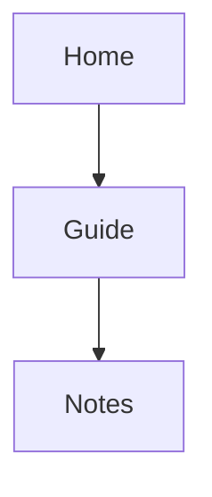

# Diagrams

A valid diagram:

```mermaid
graph TD
    Home --> Guide
    Guide --> Notes
```

An invalid diagram shows an error box and its source:

```mermaid
graph TD
    this is not --> a [valid diagram
```
